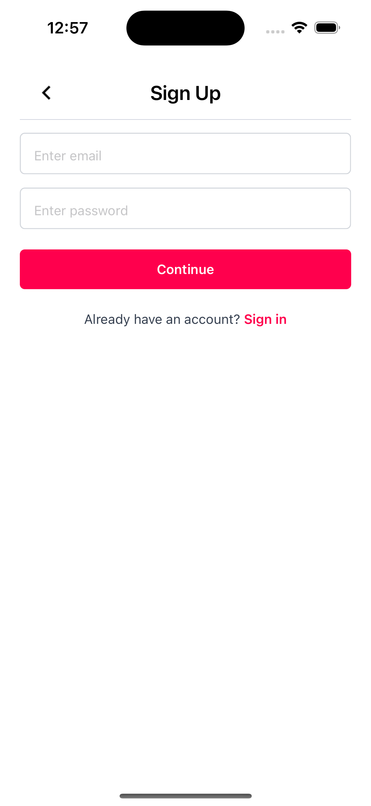
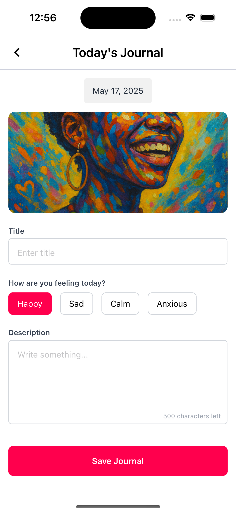
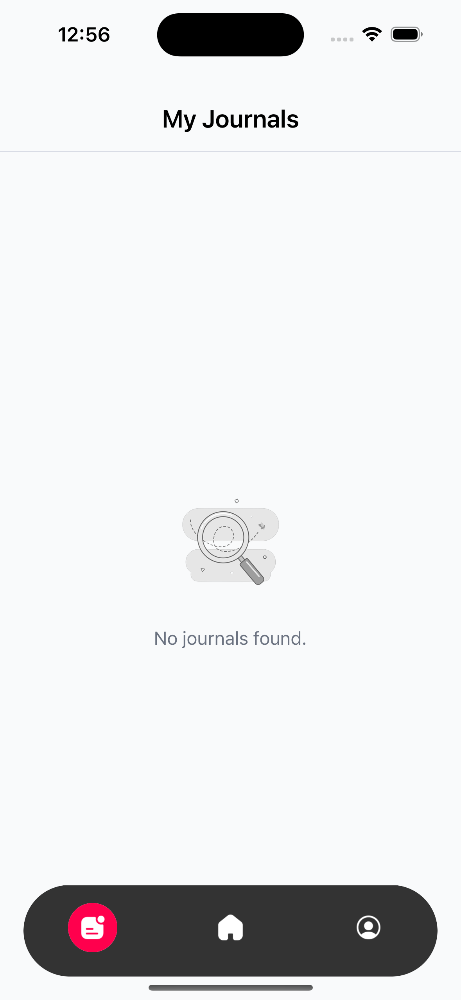
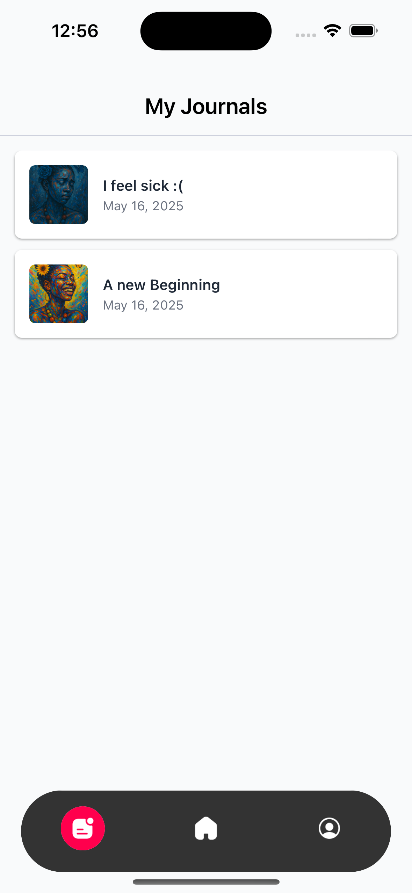
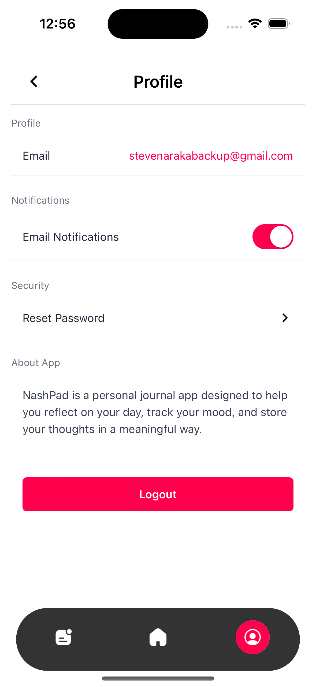
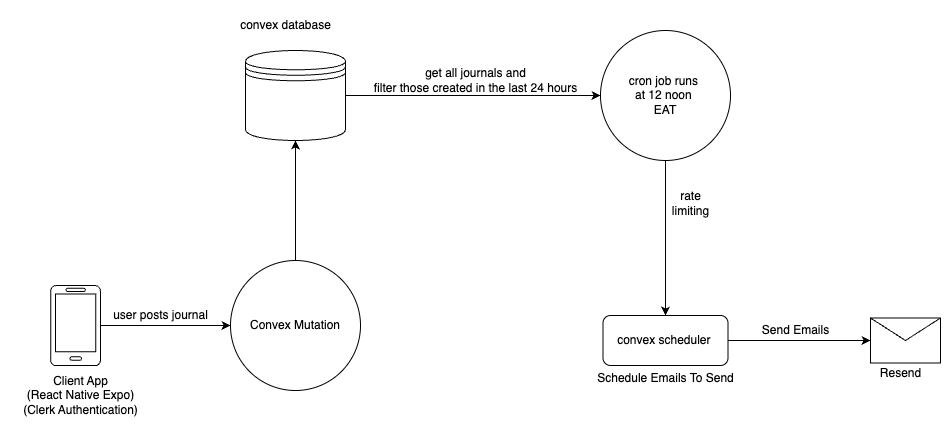
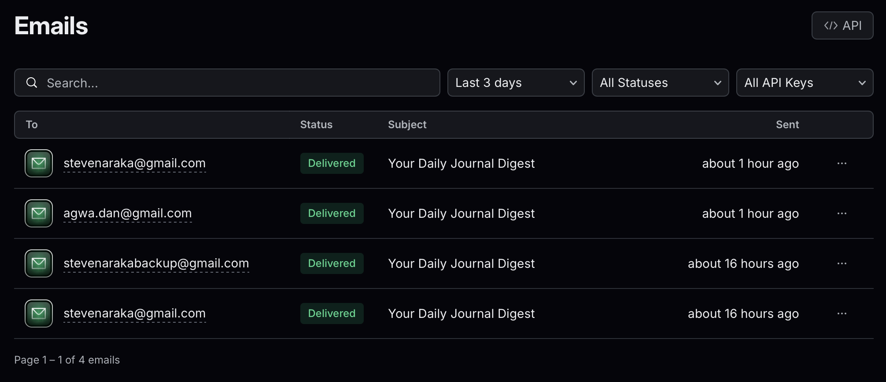
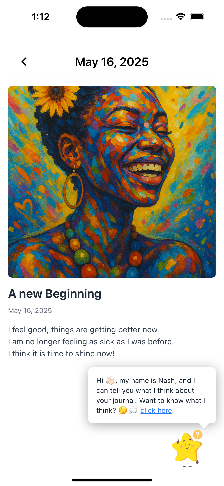
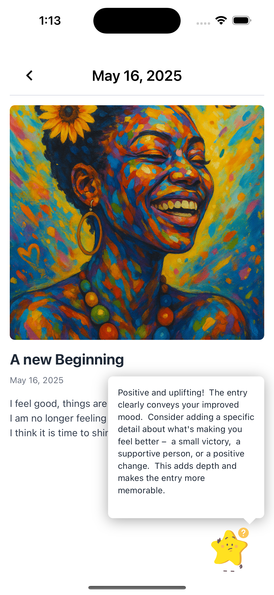

# 📝 Nashpad Journal App

Nashpad Journal is a mobile journaling app built with **React Native and Expo**. It provides users with a secure, real-time experience to log thoughts and moods, backed by a modern serverless architecture.

---

## App Branding and UI


| Welcome | Sign Up | Home |
|-|-|-|
|  |  |  |

| Add Journal | Journals Empty | View Journals | Settings |
|-|-|-|-|
|  |  |  |  |
---

## ⚙️ Architecture Overview

#### Architecture Diagram


- **Frontend:** [React Native](https://reactnative.dev/) (via [Expo](https://expo.dev/))  
- **Authentication:** [Clerk](https://clerk.dev/) for secure user management  
- **Backend:** [Convex](https://convex.dev/) for:
  - Real-time database
  - Serverless functions
  - Scheduled cron jobs
- **Email Notifications:** [Resend](https://resend.com/) for transactional emails
- **Styling:** [Tailwind CSS](https://tailwindcss.com/) via `nativewind`
- **AI Feature:** Bonus **AI Assistant** allows you to reflect on your journal entries through a natural, conversational interface.


Convex was chosen for its tight integration with React, ease of managing server functions and database logic in a type-safe way, and support for real-time syncing and scheduled tasks, making it an ideal fit for a dynamic journaling app.

---

## 🚀 Getting Started

### Prerequisites

- Node.js (>= 18)
- Yarn or npm
- Expo CLI:  
  ```bash
  npm install -g expo-cli

#### 1. Clone the repository
`git clone https://github.com/yourusername/nashpad-journal.git`
`cd nashpad-journal`

#### 2. Install dependencies
`yarn install`
# or
`npm install`

#### 3. Setup Environment Variables
Create a .env file at the root with the following:
`EXPO_PUBLIC_CLERK_PUBLISHABLE_KEY=your_clerk_publishable_key`
`EXPO_PUBLIC_CONVEX_URL=your_convex_url`
For local development, ensure you're running convex dev if needed.

#### 4. 4. Start the App
`npx expo start`

## 📱 Demo

Download and try out the app on Android:

👉 [Download APK](https://www.upload-apk.com/eNWkStjnvpSbjRx)

## Emails
The app is able to send emails using Resend. You can test this feature by signing up and creating a journal entry. The app will send you an email at noon with other users journal entries.


## AI Assistant (Bonus Feature 😉)
The AI Assistant feature allows users to interact with their journal entries in a conversational manner. It uses Google's Gemini API to generate responses based on the user's journal.

| AI Assistant | AI Assistant Response |
|-|-|
|  |  |

